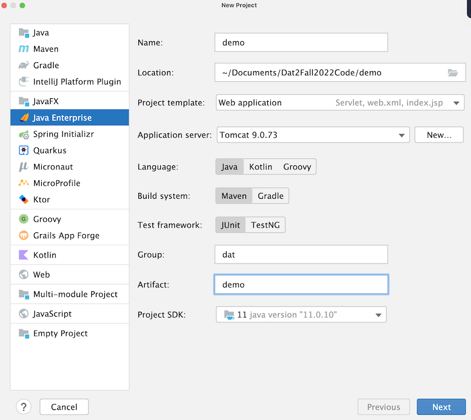

# Dokumentation <!-- # er tilsvarende h1. ## er tilsvarede h2 ect -->

Dette er min egen dokumentation af Java Webstack. Vi skal lave et intranet og vil bruge
denne dokumentation til at bedre huske hvad vi lavede.

## Start af et nyt webprojekt

1. Opret nyt projekt i IntelliJ
2. Vælg javaEE projektskabelon
3. Java + Maven
4. Servlet dependencies

## Arkitektur 

Vi anvender en slags MVC-pattern (Model-view-control).

- Model - Entiteter og hjælpe- metoder og klasser (Der er også nogle der kalder dette
for Business-logic)
- View - JSP og frontend (css, boostrap mm)
- Control - Servlets

Husk! Ingen kommunikation mellem Model og View. Gå altid igennem controlleren.
View viser dataen, controlleren henter den fra eks. en database.

## Opret Git repository
Gå ind på terminalen og skriv:

1. git innit
2. git add .
3. git commit -m "first commit"
4. git remote add origin https://github.com/Ghostfear1713/intranet.git
5. git push -u origin main 
